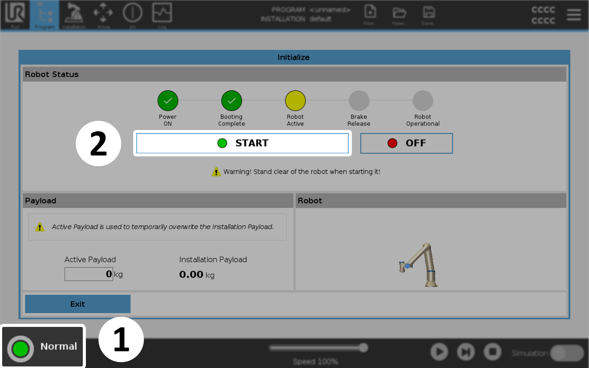
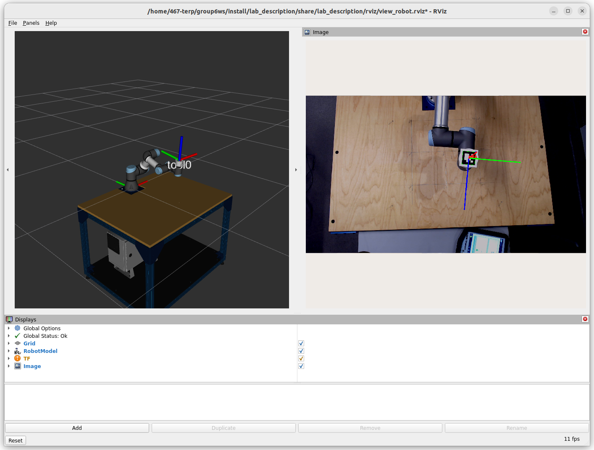
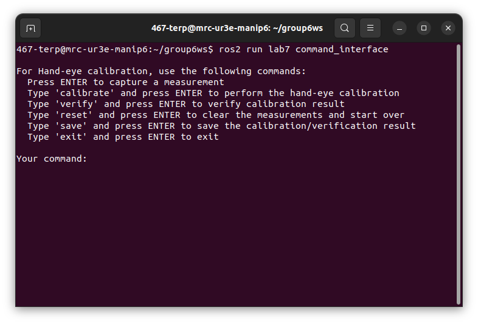
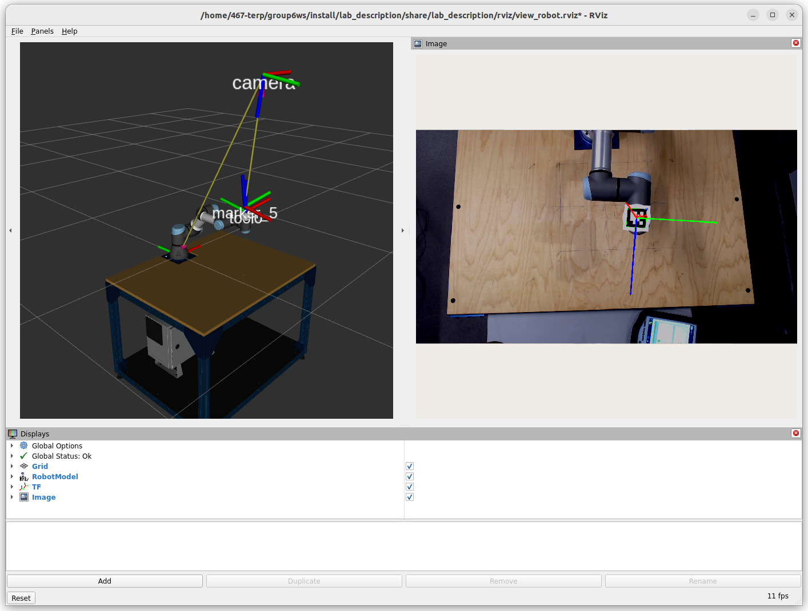

.. Steps for Lab 7 exercise
   01/09/24
   Abhishekh Reddy

Lab 7
=====

The purpose of this experiment is to perform Hand-eye Calibration for the camera and arm. In order
to use the camera to measure the position of objects and to use that information as feedback for the
control of the arm, it is necessary to know the pose of the camera in the World coordinate system.
That pose is determined by 7 parameters which must be measured. As with many complicated
measurements, it is unreasonable to believe that a single measurement is accurate enough. The
standard approach is to repeat the measurements a reasonable number of times; determine a
least-squares fit for the parameters; then check the fit by means of a separate set of measurements.
If the result of the test is not good enough, make more (ideally more accurate) measurements.

Once you have calibrated the camera, it is interesting to check the accuracy of the largest square
you found for the end effector in the next lab. You only specified the corners. MoveIt
determined the path and the trajectory. If you repeat them and observe the result with the camera,
you can compare the path and trajectory as measured by the camera with that computed from the joint
angles.

The first thing you have to do is make the first set of measurements for the calibration and record
them. Be sure to collect measurements from a broad range of positions, including some extreme ones.

Writing the code
^^^^^^^^^^^^^^^^

Verifying the calibration result involves these steps:

- Finding the mean error vector
- Finding the covariance matrix
- Finding the least squares error vector

Implement these functions in the ``lab7/src/lab7.cpp`` source file located within the workspace
source directory.

- ``findMeanErrorVector()``
- ``findCovarianceMatrix()``
- ``findLeastSquaresErrorVector()``

Always build the packages and source the workspace after modifying the source code.

.. code-block:: bash

   cd $ROS_WS && colcon build && source install/setup.bash

Performing the calibration
^^^^^^^^^^^^^^^^^^^^^^^^^^

Start the robot by turning on the `Teach Pendant <Teach Pendant Pic_>`_. Open the Initialization
window by pressing the button at the bottom-left corner of the screen. In the Initialization window,
press ``ON`` and then ``START`` to release the brakes.

   Initializing the arm

On the lab computer, use the VSCode terminal to execute the launch file for this Lab exericise to
run the calibration stack. Replace ``<number>`` with the number posted on your lab table when
entering the command.

.. code-block:: bash

   ros2 launch lab7 lab7.launch.py table:=<number>

This will start an RViz window displaying the robot and camera views side by side. The left view
replicates the real arm's pose, showing the relevant transform frames. The right view displays the
camera feed, highlighting the marker when detected.

   RViz window after executing the launch file

Start a terminal window outside VSCode by pressing ``CTRL + ALT + T`` keys, and access the container
shell. :doc:`This page </Setup/Attach-Shell>` explains more about this step in detail.

.. code-block:: bash

   docker exec -it -u 467-terp <workspace-name> bash

Now begin the command interface in this terminal window to send commands to the calibration node.

.. code-block:: bash

   ros2 run lab7 command_interface

   Command interface running in an external shell window

Perform these steps for Hand-eye calibration:

- Move the robot by hand using `Freedrive mode <Freedrive Mode_>`_ to bring the marker attached to
  the robot into the camera view.

- Set the robot to a specific pose, then press ``ENTER`` in the terminal to capture a measurement.

- Change the pose and capture a new measurement. Repeat this process 15 times.

- Run the ``calibrate`` command to initiate calibration.

In RViz, two new frames named ``camera`` and ``marker_n`` should appear in the left viewport,
representing the camera's and marker's poses, as shown in the figure below.

   RViz window after Hand-eye calibration

.. note::

   If the camera frame is positioned or oriented incorrectly, reset the measurements and perform the
   calibration again. There must be a significant variation between the end-effector poses while
   capturing measurements.

If the results look correct, save the calibration results using the ``save`` command before
proceeding to verify the calibration.

Capture at least 15 additional measurements in the same way as for calibration, then use the
``verify`` command to calculate the error vectors and covariance matrix using the previously
implemented methods.

Save the verification results using the ``save`` command again. The output will be stored in the
``output/lab7/`` directory within the ROS workspace.

.. LINK REFERENCES ---------------------------------------------------------------------------------
.. _Teach Pendant Pic: https://www.universal-robots.com/media/1814258/3pe-tp_productpicture.jpg
.. _Freedrive Mode: https://myur.universal-robots.com/manuals/content/SW_5_14/Documentation%20Menu/Software/Introduction/Freedrive
