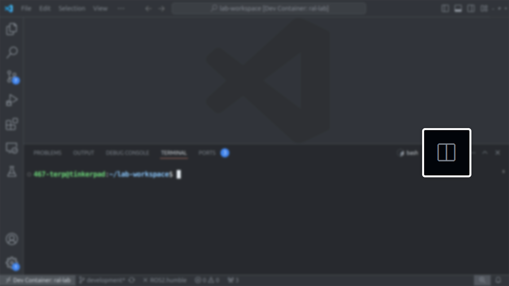
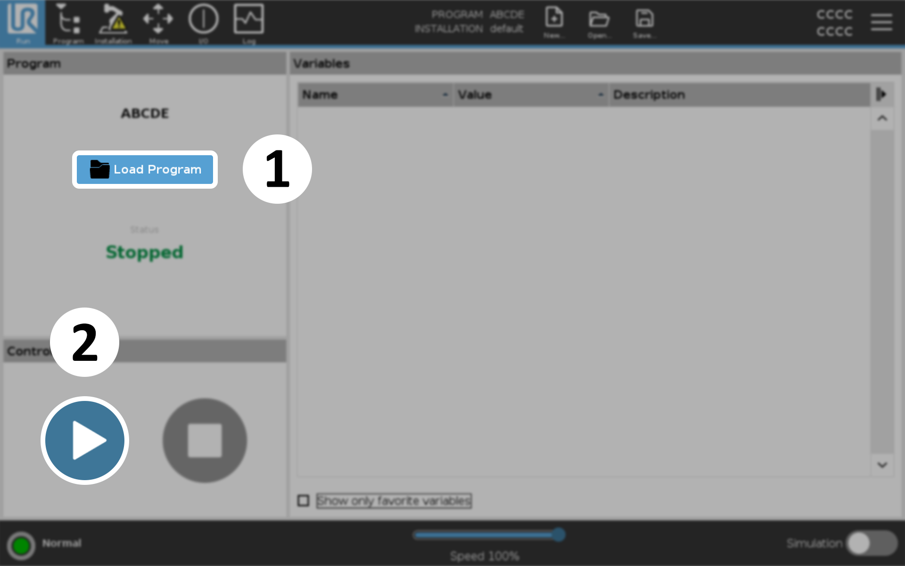

.. lab7:
.. Steps for Lab 7 Exercise
   01/09/24
   Abhishekh Reddy

Lab 7
=====

The purpose of this lab is to familiarize you with the UR3e robot and the tools
we have for making it do useful and/or interesting things. Additionally, you
will cause the end point of the robot arm to move in both a square and circle in
a vertical plane and in a horizontal plane. The Horizontal Plane is the plane
perpendicular to Z-Axis and the Vertical plane is the plane perpendicular to
either X or Y axes. Next, you will cause the end point of the arm to move in the
largest possible square that is not in the horizontal plane.

.. note::

   You will first create a successful simulation of the
   desired arm movement in Gazebo. Only after getting this simulation approved
   by the lab staff will you implement it on the actual arm. This is a very
   important safety measure.

Running the simulation
^^^^^^^^^^^^^^^^^^^^^^

Run the following command to start the simulation for Lab 7 which opens the Gazebo and RViz windows:

.. code-block:: bash

  ros2 launch lab7 lab7.launch.py

Split the VSCode terminal either by pressing ``CTRL + SHIFT + 5`` keys or by pressing this button
shown below.

   Split button for the VSCode terminal

In the new terminal, run the executable which moves the robotic arm. This is where you'll be writing
your program for this exercise.

.. code-block:: bash

  ros2 run lab7 draw_shape --ros-args -p use_sim_time:=true

This program runs an examples function by default which:

- Orients the arm into a position to draw a shape in the vertical plane using a joint-space goal.

- Draws a triangle in the vertical plane using a list of waypoints for the end-effector to follow in
  Cartesian space.

- Adjusts the end-effector to point upwards using a Cartesian space goal.

- Returns back to initial position by specifying a pre-defined, named position (``up`` in this case).

Writing the code
^^^^^^^^^^^^^^^^

The source file for this program is located at ``lab7/src/ur3e_move_interface.cpp`` inside the source
directory of workspace. This is where you'll be working for this exercise.

Go through the code inside ``UR3eMoveInterface::examplesMoveIt`` function to understand how the
motions observed in the simulation were implemented. Also refer
:ref:`this page <Description of the examples code>` for a more detailed explanation of the code.

.. toctree::
  :maxdepth: 1
  :hidden:

  Lab7/Examples-Code-Desc

Use that to write your own implementations for the following functions within the same source file:

- ``UR3eMoveInterface::drawCircleXY``
- ``UR3eMoveInterface::drawCircleYZ``
- ``UR3eMoveInterface::drawSquareXY``
- ``UR3eMoveInterface::drawSquareYZ``

Running the program to draw shapes
^^^^^^^^^^^^^^^^^^^^^^^^^^^^^^^^^^

The command for running the ``draw_shape`` program takes three arguments to define the shape, plane
and the size. The executable can run repeatedly with a different set of arguments to vary the shape
and plane.

.. code-block:: bash

  ros2 run lab7 draw_shape <shape> <plane> <size> <ros-args>

<shape>
  Options: ``circle``, ``square``

<plane>
  Options: ``horizontal`` (XY Plane), ``vertical`` (YZ Plane)

<size>
  Radius if ``<shape>`` is ``circle`` and side length if ``<shape>`` is ``square``

<ros-args>
  Mainly for setting the ``use_sim_time`` parameter to ``true`` for simulation. This isn't needed
  for the real arm.

Example 1:
  For drawing a circle in the horizontal plane with a radius of 0.25 meters in simulation.

  .. code-block:: bash

    ros2 run lab7 draw_shape circle horizontal 0.25 --ros-args -p use_sim_time:=true

Example 2:
  For drawing a square in the vertical plane with a side length of 0.2 meters on the real arm.

  .. code-block:: bash

    ros2 run lab7 draw_shape square vertical 0.2

.. note::

  The program defaults to running the examples function if any of the ``<shape>`` or ``<plane>``
  arguments are missing or incorrect.

  The program defaults to maximum size of 0.45 m radius or :math:`\frac{0.45}{\sqrt{2}}` m side
  length if the ``<size>`` argument is missing or has a value less than or equal to zero.

Controlling the real UR3e arm
^^^^^^^^^^^^^^^^^^^^^^^^^^^^^

Make sure to test the program extensively in simulation before executing it on the real arm.

Start the robot by first turning on the `Teach Pendant <Teach Pendant Pic_>`_, press the initialize
button at the bottom-left part of the screen and then press ``START`` to release the brakes.

.. figure:: images/start-robot.png
   :width: 450
   :align: center

   Initializing the arm

Then on the lab computer, launch Lab 7 with the ``sim`` argument set to ``false``.

.. code-block:: bash

  ros2 launch lab7 lab7.launch.py sim:=false

This starts the UR ROS Driver which communicates with the real arm instead of Gazebo simulation.

The arm shown in RViz sits in the upright position if the ROS driver successfully communicates with
UR3e. This might take some time.

Then on the Teach Pendant, start the ``ur3e_ros`` program.

   Starting the program to receive commands from lab computer

Signs that the connection successfully established:

  - The terminal from which you launched Lab 7 should print ``Robot connected to reverse
    interface. Ready to receive control commands``.

  - Doing a ``ros2 topic list`` should print a lot of new topics.

.. caution::

  If there are any warnings or errors in the output, stop immidiately and ask the TA or the lab
  manager.

Then in another terminal, run the executable to start drawing the shapes. Refer back to
`this section <Running the program to draw shapes_>`_ for more.

.. code-block:: bash

  ros2 run lab7 draw_shape <shape> <plane> <size>

If you enabled end-effector tracking, the plots and CSV files of the end-effector positions will be
saved at the ``output/`` directory of the workspace.

.. LINK REFERENCES -------------------------------------------------------------
.. _Teach Pendant Pic: https://www.universal-robots.com/media/1814258/3pe-tp_productpicture.jpg
