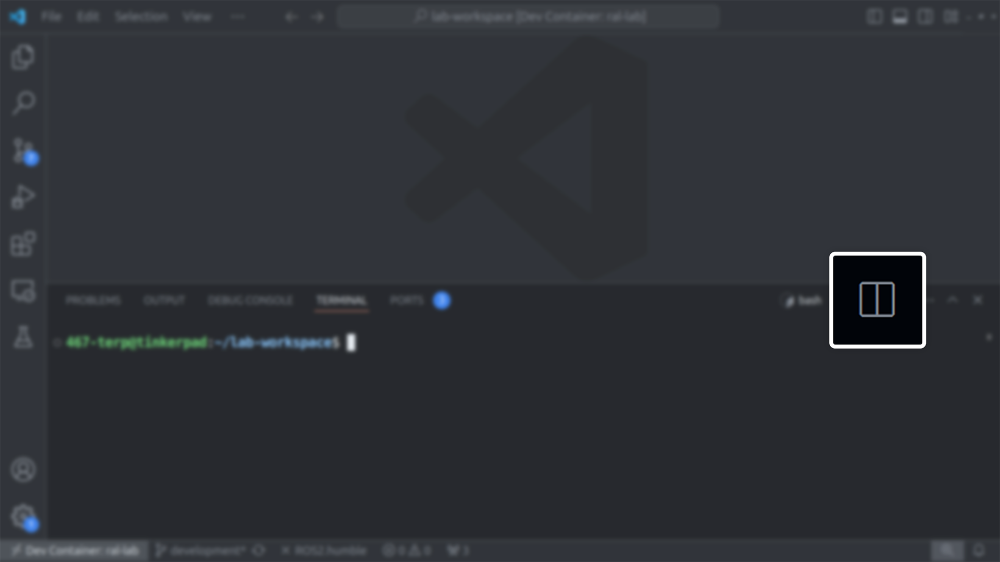
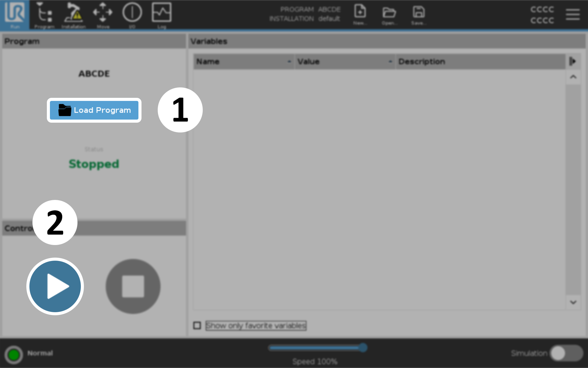

.. Steps for Lab 8 Exercise
   01/09/24
   Abhishekh Reddy

Lab 8
=====

The purpose of this lab is to familiarize you with the UR3 robot and the tools we have for making it
do useful and/or interesting things. Additionally, you will cause the end point of the robot arm to
move in both a square and circle in a vertical plane and in a horizontal plane. The horizontal plane
is the plane perpendicular to the Z-Axis and the vertical plane is the plane perpendicular to any
line in the horizontal plane.

First, you will cause the end point of the arm to move in the largest possible horizontal circle.
Then you will cause the endpoint of the arm to move in the largest possible horizontal square. Next,
cause the end point of the arm to move in the largest possible vertical square. Finally, you will
cause the end point of the arm to move through the largest possible vertical circle.

.. note::

   You will first create a successful simulation of the
   desired arm movement in Gazebo. Only after getting this simulation approved
   by the lab staff will you implement it on the actual arm. This is a very
   important safety measure.

Running the simulation
^^^^^^^^^^^^^^^^^^^^^^

Launch the Lab 8 simulation which opens both the Gazebo and RViz windows:

.. code-block:: bash

  ros2 launch lab8 lab8.launch.py

Split the VSCode terminal either by pressing ``CTRL + SHIFT + 5`` keys or by pressing this button
shown below.

   Split button for the VSCode terminal

In the new terminal, start the ``draw_shape`` node, which moves the robotic arm.

.. code-block:: bash

  ros2 run lab8 draw_shape --ros-args -p use_sim_time:=true

This node demonstrates a few example motions with the robotic arm by default, which:

- Orients the arm into position to draw a shape in the vertical plane using a joint-space goal.

- Draws a triangle in the vertical plane by following a list of waypoints for the end-effector in
  Cartesian space.

- Adjusts the end-effector to point upwards using a Cartesian-space goal.

- Returns the arm to its initial position by specifying a predefined, named position
  (up in this case).

Writing the code
^^^^^^^^^^^^^^^^

.. toctree::
  :maxdepth: 1
  :hidden:

  Lab8/Examples-Code-Desc

The source file for this lab exercise is located at ``lab8/src/lab8.cpp`` within the workspace's
source directory. This is where you will write the code for this exercise.

Go through the code inside the ``examples.cpp`` file within the same folder to understand how the
motions observed in the simulation are implemented.  You can also refer
:doc:`this page </Lab8/Examples-Code-Desc>` for more detailed explanations of any section of
the code as needed.

Now, use the reference code to write your own implementations for the following functions in the
``lab8.cpp`` source file:

- ``UR3eMoveInterface::drawCircleXY``
- ``UR3eMoveInterface::drawCircleYZ``
- ``UR3eMoveInterface::drawSquareXY``
- ``UR3eMoveInterface::drawSquareYZ``

Build the packages and source the workspace after writing the code.

.. code-block:: bash

  cd $ROS_WS && colcon build && source install/setup.bash

Running the program to draw shapes
^^^^^^^^^^^^^^^^^^^^^^^^^^^^^^^^^^

The command for running the ``draw_shape`` node takes three arguments to define the shape, plane,
and size. The node can be executed repeatedly with different argument combinations.

.. code-block:: bash

  ros2 run lab8 draw_shape <shape> <plane> <size> <ros-args>

<shape>
  Options: ``circle``, ``square``

<plane>
  Options: ``horizontal`` (XY Plane), ``vertical`` (YZ Plane)

<size>
  Radius if ``<shape>`` is ``circle`` and side length if ``<shape>`` is ``square``

<ros-args>
  Mainly for setting the ``use_sim_time`` parameter to ``true`` for simulation. This isn't needed
  for the real arm.

Example 1:
  For drawing a circle in the horizontal plane with a radius of 0.25 meters in simulation.

  .. code-block:: bash

    ros2 run lab8 draw_shape circle horizontal 0.25 --ros-args -p use_sim_time:=true

Example 2:
  For drawing a square in the vertical plane with a side length of 0.2 meters on the real arm.

  .. code-block:: bash

    ros2 run lab8 draw_shape square vertical 0.2

.. note::

  The program defaults to running the examples function if any of the ``<shape>`` or ``<plane>``
  arguments are missing or incorrect.

  Leaving the ``<size>`` argument as blank will set the maximum size of 0.45 m radius for the circle
  or :math:`\frac{0.45}{\sqrt{2}}` m side length for square.

Controlling the real UR3e arm
^^^^^^^^^^^^^^^^^^^^^^^^^^^^^

Start the robot by turning on the `Teach Pendant <Teach Pendant Pic_>`_. Open the Initialization
window by pressing the button at the bottom-left corner of the screen. In the Initialization window,
press ``ON`` and then ``START`` to release the brakes.

.. figure:: images/start-robot.png
   :width: 450
   :align: center

   Initializing the arm

Then on the lab computer, launch Lab 8 with the ``sim`` argument set to ``false``.

.. code-block:: bash

  ros2 launch lab8 lab8.launch.py sim:=false

This starts the UR ROS Driver which communicates with the real arm instead of Gazebo simulation.

The arm shown in RViz sits in the upright position if the ROS driver successfully communicates with
UR3e. This might take some time.

Then on the Teach Pendant, start the ``ur3e_ros`` program.

   Starting the program to receive commands from lab computer

Signs that the connection successfully established:

  - The terminal from which you launched Lab 8 should print ``Robot connected to reverse
    interface. Ready to receive control commands``.

  - Doing a ``ros2 topic list`` should print a lot of new topics.

.. caution::

  If there are any warnings or errors in the output, stop immidiately and ask the TA or the lab
  manager.

Then in another terminal, run the ``draw_shape`` node to start drawing the shapes with the arm.
Refer back to `this section <Running the program to draw shapes_>`_ for more.

.. code-block:: bash

  ros2 run lab8 draw_shape <shape> <plane> <size>

If you enabled end-effector tracking, the plots and CSV files of the end-effector positions will be
saved at the ``output/lab8/`` directory of the workspace. Refer
:ref:`this section <end effector tracking>` for more information.

.. LINK REFERENCES ---------------------------------------------------------------------------------
.. _Teach Pendant Pic: https://www.universal-robots.com/media/1814258/3pe-tp_productpicture.jpg
